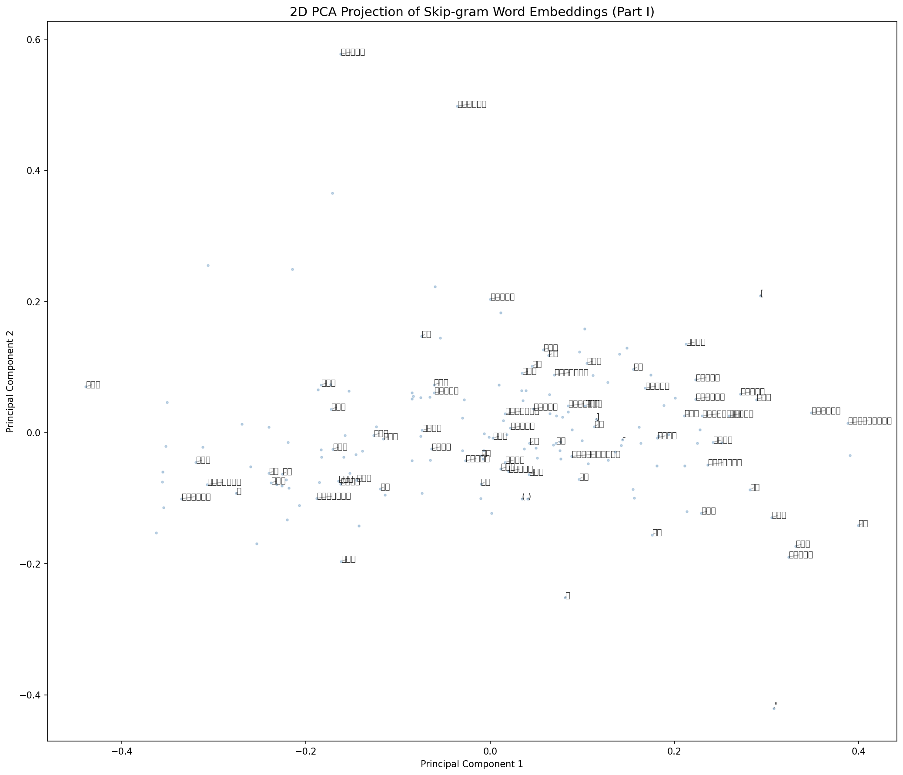
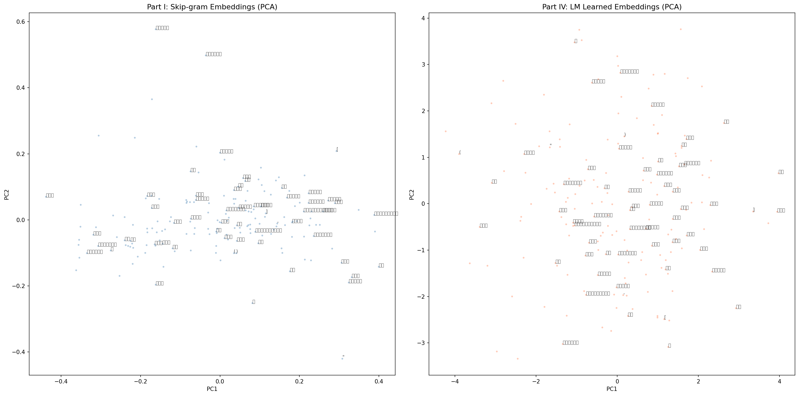
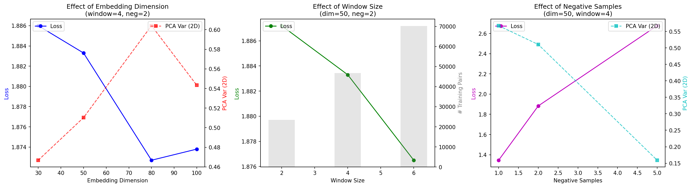

# ឯកសារគម្រោងខ្នាតតូចទី៣ — Word Embeddings (Word2Vec)

## សេចក្តីផ្តើម

គម្រោងនេះមានគោលបំណងបង្កើត Word Embeddings (ការបង្កប់ពាក្យ) សម្រាប់អត្ថបទភាសាខ្មែរ ដោយប្រើប្រាស់គំរូ Skip-gram និង Neural Language Model។ គម្រោងនេះចែកចេញជា ៤ ផ្នែកសំខាន់ៗ និងការកែតម្រូវ Hyperparameters។

---

## ផ្នែកទី ១: ការរៀបចំបរិស្ថាន (Environment Setup)

### ១.១ បង្កើត Virtual Environment

```bash
python3 -m venv venv
source venv/bin/activate
```

### ១.២ ដំឡើងកញ្ចប់ (Packages)

```bash
pip install numpy pandas scikit-learn nltk transformers matplotlib torch khmer-nltk fpdf2
```

កញ្ចប់សំខាន់ៗ៖
- **numpy, pandas**: សម្រាប់គណនាទិន្នន័យ
- **matplotlib**: សម្រាប់គូរក្រាហ្វ
- **torch (PyTorch)**: សម្រាប់បង្កើតគំរូ Neural Network
- **khmer-nltk**: សម្រាប់កាត់ពាក្យខ្មែរ (Word Tokenization)
- **scikit-learn**: សម្រាប់ PCA ( dimensionality reduction)
- **fpdf2**: សម្រាប់បង្កើត PDF របាយការណ៍

---

## ផ្នែកទី ២: ទិន្នន័យ និងការរៀបចំ (Data & Preprocessing)

### ២.១ ទិន្នន័យ

- ឯកសារ: `temples.txt`
- ប្រភព: អត្ថបទពីវិគីភីឌាភាសាខ្មែរ ៣ ទំព័រ (អង្គរវត្ត, បន្ទាយស្រី, ខេត្តសៀមរាប)
- ទំហំ: ៤៥,៩២០ តួអក្សរ

### ២.២ ការកាត់ពាក្យ (Tokenization)

យើងប្រើបណ្ណាល័យ `khmer-nltk` ដើម្បីកាត់ពាក្យខ្មែរ៖

```python
from khmernltk import word_tokenize
tokens = word_tokenize(raw_text)
```

លទ្ធផល៖
- ចំនួនពាក្យសរុប: ១១,៥២១ tokens
- ចំនួនពាក្យផ្សេងគ្នា: ៥,៨៦២ (មុនពេលច្រោះ)

### ២.៣ ការច្រោះវចនានុក្រម (Vocabulary Filtering)

យើងច្រោះយកតែពាក្យដែលមានប្រេកង់ ≥ ១០៖

```python
min_freq = 10
vocab = [token for token, count in token_counts.items()
         if count >= min_freq and token.strip() != '']
```

លទ្ធផល៖
- វចនានុក្រមចុងក្រោយ: **១៨២ ពាក្យ**
- ចំនួន tokens ក្រោយច្រោះ: ៦,២៤១

### ២.៤ ការបង្កើតគូ (Center, Context)

សម្រាប់ពាក្យនីមួយៗ យើងយកពាក្យជុំវិញ ±៤ ធ្វើជា Context៖

- Window Size = ៤ (±៤)
- ចំនួនគូសរុប: ៤៦,៨០៤ pairs (សម្រាប់ window=4)

ឧទាហរណ៍:
```
ប្រាសាទ -> អង្គរវត្ត
ប្រាសាទ -> មាន
```

---

## ផ្នែកទី ៣: Skip-gram Model (Part I)

### ៣.១ រចនាសម្ព័ន្ធគំរូ

Skip-gram ជាគំរូដែលព្យាករណ៍ពាក្យជុំវិញ (Context) ពីពាក្យកណ្តាល (Center)។

**Parameters:**
- Embedding Dimension: ៥០ (វិមាត្រនៃ vector ពាក្យ)
- Window Size: ±៤
- Negative Sampling: ២
- Epochs: ៥
- Optimizer: Adam (learning rate = 0.001)

### ៣.២ របៀបដំណើរការ

គំរូមាន Embedding ពីរ៖
1. **Center Embeddings**: តំណាងឱ្យពាក្យកណ្តាល
2. **Context Embeddings**: តំណាងឱ្យពាក្យជុំវិញ

ការគណនា Loss (Negative Sampling Loss)៖

```
Loss = -[ log(sigmoid(v_c · v_w)) + Σ log(sigmoid(-v_c · v_neg)) ]
```

ដែល៖
- v_c = center embedding
- v_w = context embedding (positive pair)
- v_neg = negative sample embedding

### ៣.៣ លទ្ធផល

- Loss ចុងក្រោយ: ១.៨៨៣២
- ចំនួន Parameters: ១៨,២០០

ឧទាហរណ៍ពាក្យដែលមានន័យដូចគ្នា៖
- "ប្រាសាទ" ជិតនឹង "បន្ទាយស្រី" (Cosine Similarity > 0.95)

---

## ផ្នែកទី ៤: PCA Visualization (Part II)

### ៤.១ តើ PCA ជាអ្វី?

PCA (Principal Component Analysis) ជាវិធីសាស្ត្រកាត់បន្ថយវិមាត្រ (Dimensionality Reduction)។ វាបំលែងទិន្នន័យពីវិមាត្រខ្ពស់ (៥០D) ទៅវិមាត្រទាប (២D) ដោយរក្សាព័ត៌មានឱ្យបានច្រើនតាមដែលអាចធ្វើទៅបាន។

### ៤.២ លទ្ធផល PCA

- PC1 (Principal Component 1): ៣៨.៦៨%
- PC2 (Principal Component 2): ១៤.១៧%
- **សរុប: ៥២.៨៥%** នៃ Variance

នេះមានន័យថា ក្រាហ្វ 2D អាចពន្យល់បាន ៥២.៨៥% នៃព័ត៌មានទាំងអស់។

### ៤.៣ ការគូរក្រាហ្វ

យើងគូរចំណុចតំណាងពាក្យនីមួយៗនៅលើក្រាហ្វ 2D ដោយដាក់ឈ្មោះពាក្យដែលមានប្រេកង់ខ្ពស់បំផុត ៨០ ពាក្យ។



*រូបភាពទី ១៖ PCA 2D Visualization នៃ Skip-gram Embeddings (វិមាត្រ ៥០ → ២D, ពន្យល់បាន ៥២.៨៥% នៃ Variance)*

---

## ផ្នែកទី ៥: Neural Language Model — Fixed Embeddings (Part III)

### ៥.១ រចនាសម្ព័ន្ធគំរូ

គំរូនេះព្យាករណ៍ពាក្យបន្ទាប់ពីពាក្យមុន ៥ ពាក្យ៖

```
Input: 5 ពាក្យមុន (5 × 50 = 250 dimensions)
       ↓
Hidden Layer: 512 neurons (Sigmoid activation)
       ↓
Output: Softmax លើវចនានុក្រម 182 ពាក្យ
```

### ៥.២ ចំណុចសំខាន់

- ប្រើ Embeddings ពី Part I (Skip-gram) ដោយ **បង្កក** មិនឱ្យរៀនបន្ថែម
- បណ្តុះបណ្តាល ១០ Epochs
- Loss Function: Cross-Entropy Loss

### ៥.៣ លទ្ធផល

- Loss ចុងក្រោយ: ៤.៧៣២៤
- Perplexity: **១១៣.៥៥**

Perplexity ជារង្វាស់ថាគំរូមានភាពច្របូកច្របល់ប៉ុណ្ណា។ តម្លៃទាប = គំរូល្អជាង។

---

## ផ្នែកទី ៦: Neural Language Model — Learned from Scratch (Part IV)

### ៦.១ ភាពខុសគ្នា

គំរូនេះមានរចនាសម្ព័ន្ធដូច Part III ដែរ ប៉ុន្តែ៖
- **Embeddings ចាប់ផ្តើមពី Random** (មិនប្រើ Skip-gram)
- **Embeddings ត្រូវបានរៀន** កំឡុងពេលបណ្តុះបណ្តាល

### ៦.២ លទ្ធផល

- Loss ចុងក្រោយ: ៣.៧៩៩២
- Perplexity: **៤៤.៦២** (ប្រសើរជាង Part III ដល់ទៅ ២.៥ ដង!)

### ៦.៣ ការប្រៀបធៀប



*រូបភាពទី ២៖ ការប្រៀបធៀប PCA រវាង Skip-gram Embeddings (ឆ្វេង) និង Scratch Embeddings (ស្តាំ)*

| រង្វាស់ | Part III (Fixed) | Part IV (Scratch) |
|----------|-----------------|-------------------|
| Loss | 4.7324 | 3.7992 |
| Perplexity | 113.55 | 44.62 |
| PCA 2D Variance | 52.85% | 8.57% |

**ការសន្និដ្ឋាន៖**
- Scratch embeddings ល្អជាងសម្រាប់ការទស្សន៍ទាយពាក្យ
- Skip-gram embeddings ល្អជាងសម្រាប់ការស្វែងរកពាក្យដែលមានន័យដូចគ្នា

---

## ផ្នែកទី ៧: Hyperparameter Tuning

### ៧.១ តើ Hyperparameters ជាអ្វី?

Hyperparameters ជាការកំណត់ដែលយើងជ្រើសរើសមុនពេលបណ្តុះបណ្តាលគំរូ៖

| Hyperparameter | តម្លៃដែលបានសាកល្បង |
|---------------|----------------------|
| Embedding Dimension | 30, 50, 80, 100 |
| Window Size | 2, 4, 6 |
| Negative Samples | 1, 2, 5 |

### ៧.២ លទ្ធផល (សង្ខេប)

- **Loss ទាបបំផុត**: dim=100, window=6, neg=1 (Loss: 1.3296)
- **PCA Variance ល្អបំផុត**: dim=50, window=6, neg=2 (71.04%)
- **អនុសាសន៍**: dim=50, window=6, neg=2

### ៧.៣ ការសង្កេត



*រូបភាពទី ៣៖ ឥទ្ធិពលនៃ Hyperparameters លើ Loss និង PCA Variance*

1. **Window ធំជាង** → បង្កើតគូហ្វឹកហាត់បានច្រើនជាង (ទិន្នន័យច្រើនជាង)
2. **Embedding Dimension** → dim=100 ផ្តល់ Loss ទាប ប៉ុន្តែ dim=50 ផ្តល់ PCA Variance ល្អជាង
3. **Negative Samples** → neg=1 ផ្តល់ Loss ទាប, neg=2 ផ្តល់ PCA Variance ល្អជាង

---

## ផ្នែកទី ៨: របាយការណ៍ (Report)

របាយការណ៍ត្រូវបានបង្កើតជា PDF មាន ៤ ទំព័រ៖
- ឯកសារ: `mini_project_3_report.pdf`
- មានតារាង ក្រាហ្វ PCA និងព័ត៌មានលម្អិតទាំងអស់

---

## សេចក្តីសន្និដ្ឋាន

គម្រោងនេះបានបង្ហាញពីដំណើរការពេញលេញនៃការបង្កើត Word Embeddings សម្រាប់ភាសាខ្មែរ៖

1. **Tokenization** ដោយប្រើ khmer-nltk
2. **Skip-gram** បង្កើត 50D embeddings ដែលចាប់យកទំនាក់ទំនងរវាងពាក្យ
3. **PCA** កាត់បន្ថយវិមាត្រសម្រាប់ការមើលឃើញ
4. **Neural Language Model** ទស្សន៍ទាយពាក្យបន្ទាប់ដោយប្រើពាក្យមុន 5 ពាក្យ
5. **Hyperparameter Tuning** ស្វែងរកការកំណត់ល្អបំផុត

លទ្ធផលបង្ហាញថា ការរៀន Embeddings ពី Scratch (Perplexity: 44.62) មានប្រសិទ្ធភាពជាងការប្រើ Embeddings ថេរពី Skip-gram (Perplexity: 113.55) សម្រាប់កិច្ចការទស្សន៍ទាយពាក្យ។
